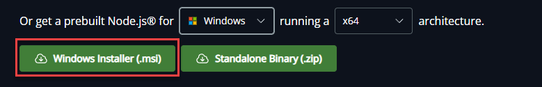
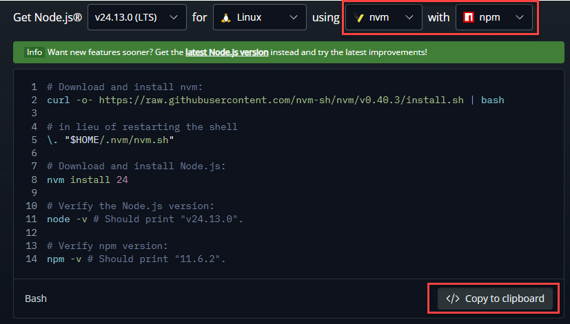
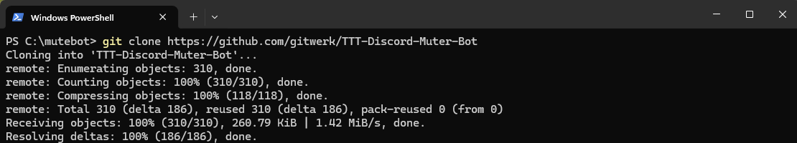
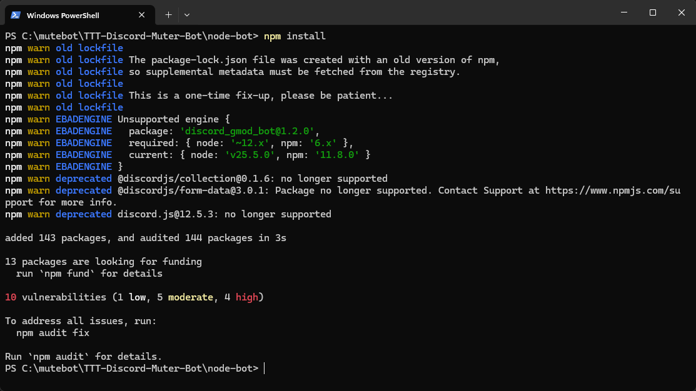
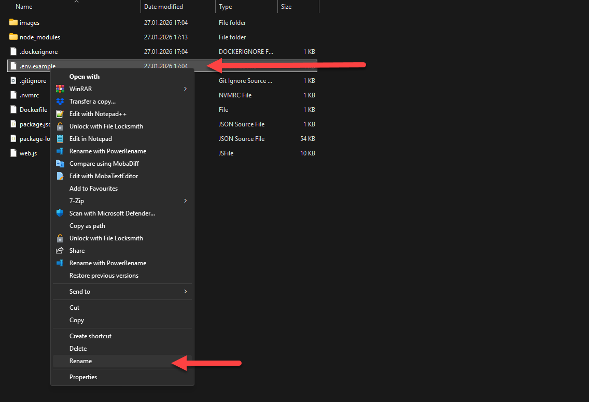
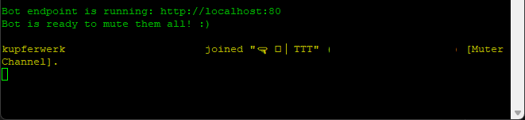
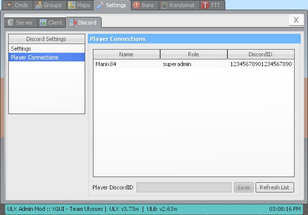
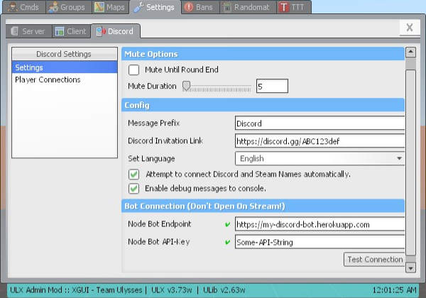
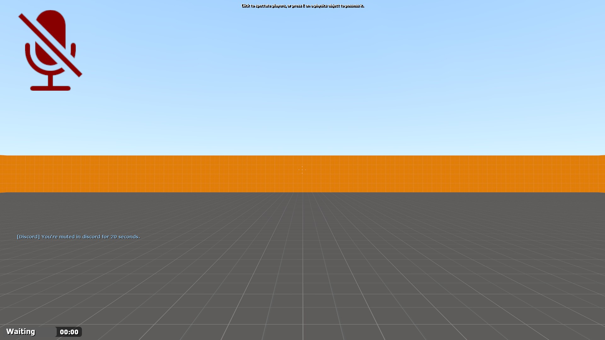

# Discord Mutebot for TTT2 (Garrys Mod TTT)

This mod was fork  [Manix84's Mutebot](https://github.com/manix84/discord_gmod_bot) and was updated and tested 2026.


## Features
- Node JS Bot that instantly mutes players on Discord when they die.
- Secure & Authenticated connection, so no-one should be highjacking your bot communication.
- Discord Server link. When someone connects, they get told to join your server, if they're not already connected.
- Mute a Player for the entire round, or simply for a few seconds.
- Automatically connect players when they join your server. If a new player joins, they're on the Discord server already, and use the same name, they'll get connected without even prompting them.
- ULX Support:
    - Easily change Settings via ULX
    - Add Discord ID's via ULX

<br>
    

### important Information READ FIRST!
You dont need ANY Steam Workshop Addon regarding the Mutebot for it to work. all you need is explaned in this guide. If you have any questions, please open an issue here on github.

This manual is for Windows and Linux. if some steps are different, the guide will clearly state the coresponding command. if no statement is made, the command or step will work on both.

The Manual for the Windows-Version is made for POWERSHELL! Use Powershell insteam of CMD!


### Prerequisites
- You have to have already installed a Garry's Mod Server with the TTT Gamemode.
- Your Server must either run on Windows or Linux and you must have Administrator or root access
- You need to have a Discord voice Channel setup with Administration rights to it

<br><br>

## Installation Part 1: Generate Discord credentials

1. Login to the Discord Developers Page [here](https://discord.com/developers/applications) and create a <b>New Application</b>
2. Select a Name for your application
3. Navigate to the OAtuh2 Tab. 
4. Copy and store the following informations for later use: 
    - `Client ID`
    - `Client Secret` (Click on "Reset Secret")

5. Open the Discord App on your PC and navigate to your Discord Channel
6. Right-Click onto the Voice-Channel which you plan to use for TTT and select <b>Copy Channel ID</b> and store for later use.
7. Left Click on your username on the bottom left, and click <b>Copy User ID</b>

You should now have the following information:
- `Client ID`
- `Client Secret`
- `Channel ID`
- `User ID`

<br>
<br>

## Installation Part 2: Node.js

### If you are on Windows:
Navigate to [the Nodejs Website](https://nodejs.org/en/download) and download the Windows <b>Installer.msi

</b> 

### If you are on Linux:
Select the LTS Version for Linux using <b>nvm with npm</b>. 
Copy the prompt to clipboard and run it on your machine.



(If you have an error message regarding curl, you might need to install curl first. using this command)
```
sudo apt-get install curl
```
<br><br>

## Installation Part 3: Install git

### If you are on Windows:
Navigate to [the git website](https://git-scm.com/install/windows) and download the Windows installer. 

### If you are on Linux:
Run this command:
```
apt-get install git
```
<br><br>

## Installation Part 4: Clone Repo & install dependencies

Make a folder on your System 

<b>Windows</b> e.g C:\mutebot<br>
<b>Linux</b> e.g /home/your-username/mutebot/

and open a Terminal (Powershell or Terminal) and run the following command: 

```
git clone https://github.com/gitwerk/TTT-Discord-Muter-Bot
```


Navigate into the <b>node bot</b> folder within the open terminal 
<br><br>
<b>Windows</b>
```
cd .\TTT-Discord-Muter-Bot\node-bot\
```
<br>
<b>Linux</b>

```
cd TTT-Discord-Muter-Bot/node-bot/
```

Install the Node JS dependensies by running the following command 
```
npm install
```

<br><br>

## Installation Part 5: Setup the Node Bot

Rename the <b>.env.example</b> file to <b>.env</b> either in the explorer or via Command. 

<b>Windows</b>
```
mv .\.env.example .env
```

<b>Linux</b>
```
mv .env.example .env
```
or on Windows via Explorer:


Open the <b>.env</b> file in an Editor of your choise (e.g Notepad, NP++ or Nano on Linux)

<b>Windows</b>
```
notepad .\.env
```

<b>Linux</b>
```
nano .env
```
Replace the corresponding strings in the file: 

`DISCORD_TOKEN` = `Your Client Secret`<br>
`DISCORD_CHANNEL` = `Your Voice Channel ID`<br>
`DISCORD_GUID` = `Your Client ID`

Save the file.

## Installation Part 6: Copy the Addon to your Server

1. Navigate back to the root folder <b>TTT-Discord-Muter-Bot</b>
2. Copy the folder <b>mutebot-server-addon</b> to your Garrys Mod Server addons folder. <br>
Usually it looks like this: <b>garrysmod/addons/</b>

## Installation Part 7: Adjust the server.cfg of your Garrys Mod Server

1. Navigate to your Garrys Mod Sever folder into the cfg directory <br>
<b>garrysmod/cfg/</b>
2. Open the <b>server.cfg</b> with an Editor of your choice and add the following lines:

```
// --- Mutebot ---
discord_endpoint       "http://localhost:37405"
discord_api_key			"mutebot"

discord_mute_duration 	0
discord_debug 			0
```
You could change existing values, or add those entries if wished:

`discord_server_link`: The Link of your Discord server. Displayed as Text for new players. purely cosmetic.<br>
`discord_mute_round`: Do you want to mute the end of the round after death? (1=Yes, 0=No)<br>
`discord_mute_duration`: How long do you want the player to be muted after death, in seconds. (0=till the end of the round)
`discord_auto_connect`: If enabled, when an unknown player connects, it will try to match the Steam Nickname, to the Discord Nickname.(1=Enabled, 0=Disabled)<br>
`discord_debug`: Display debug messaged in the console.

## Installation Part 8: Copy the Autostart File

Final installation step is to copy the <b>death_mute.lua</b> file to your server. 

1. Navigate to the git clone on your Maschine:<br>
<b>TTT-Discord-Muter-Bot\lua\autorun\server</b>

Copy the File <b>death_mute.lua</b> to the same directory on your Server:
<br><b>garrysmod/lua/autorun/server/</b>

## Usage Part 1: How to start the bot

To use the bot, all you need is to <b>start the node bot.</b>

1. Open a Terminal (Powershell or Terminal) on your Machine. 
2. Navigate to the <b>node-bot</b> directory
3. Run the following Command:
```
Node .
```
4. Just leave the console open like this for the duration of your game-session. you should see in the console who connects and if someone gets muted.<br>


## Usage Part 2: How to link your Discord user with the bot

Every user that connects to the server, needs to link himself to the bot. <br>Otherwise IT WILL NOT WORK.
<br>
1. Every user needs to collect their `User ID` by Left Click on their username on the bottom left, and click <b>Copy User ID</b>
2. Once connected to the Garrys Mod Server, they need to paste this command into the Chat:<br>`!discrod USER ID`<br><br>e.g
```
!discord 508381664309673900
```
alternatively, the Server-Admin can paste the Discord ID of each player via ULX.<br>



<br><br><br><br>

# Credits
- Marcel Transier - The original creator of [ttt_discord_bot](https://github.com/marceltransier/ttt_discord_bot.git), from which this is based.
- I used [discord.js](https://discord.js.org) in this project. Thanks for the easy opportunity writing a discord bot in javascript!
- Thanks for the great Garry's Mod gamemode [Trouble in Terrorist Town](http://ttt.badking.net) I made this bot for.


## License
This project is licensed under the MIT License - see the [LICENSE](LICENSE) file for details

## Screenshots
### ULX Settings



### Muting in action

